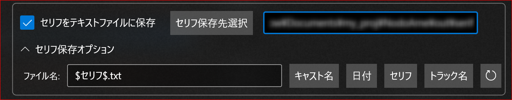

# NodeAme（ノドアメ） :id=nodoame

> [!Note|iconVisibility:hidden]
> 最新版：${tag_name}

しゃべる[CeVIO](https://cevio.jp/)ソング・[VoiSona](https://voisona.com/)補助ツール [#喋らせてみた](https://www.google.com/search?q=%23%E5%96%8B%E3%82%89%E3%81%9B%E3%81%A6%E3%81%BF%E3%81%9F)

## お知らせ

### v0.4アルファ版

> [!Note]
>しゃべり方が上手くいかないボイスや、タイミング情報が失われてしまう場合に効果がある「音節単位分割」機能を追加したアルファ版を公開しています。
>
>[先行公開版一覧はこちら](https://github.com/InuInu2022/NodoAme.Home/releases)

### 【超重要】いぬいぬのニセモノがいるみたいです！(2022-09-05)

Qiitaとbowlrollのアカウントはわたし（@InuInuGames）じゃないです！！！！
bowlrollの誘導先で配布されていたものは正式なNodoAmeじゃありません！
**絶対にダウンロードしないでください！**
予備のbowlrollからの配布は終了しました。

記事のダウンロードリンク、【ニセモノ】です。
ウイルスとか入っている可能性があるので
【絶対にダウンロードしないで】ください！

### ご紹介いただきました

> [!Note]
> ニコニコ動画の公式放送「[ソフトウェアトーク動画投稿祭応援しまくる祭](https://live.nicovideo.jp/watch/lv336019216#32:11)」でご紹介いただきました。

[#投稿祭応援しまくる祭 ご紹介ありがとうございました動画【NodoAme】](https://ext.nicovideo.jp/thumb/sm40237436 ':include :type=iframe width=560px height=200px scrolling=no frameborder=0 style="border:solid 1px #ccc;"')

### Twitterコミュニティ

> [!Note]
> 試しに[Twitterコミュニティ](https://twitter.com/i/communities/1500356662636716034)作ってみました！
> Twitterをやられている方はご確認ください！
> https://twitter.com/i/communities/1500356662636716034

## __charm:candy__ これはなに？ :id=whats_nodoame

[CeVIO ソング](https://cevio.jp/products_cevio_ai/)（可不ちゃんなど）をしゃべってる風に歌わせるための補助ツールです。
おまけ機能で歌詞の表記変換(発音通りのひらがな・音素)機能もあります。


## __el:video-alt__ 紹介動画 :id=movies

- __fa-brands:youtube__ [YouTube](https://youtu.be/lHshJSPfd-M)
- __simple-icons:niconico__ [niconico](https://nico.ms/sm39928066)

[YouTube video player](https://www.youtube.com/embed/lHshJSPfd-M ':include :type=iframe width=560px height=315px allowfullscreen')

[可不ちゃんにしゃべってもらえるソフトつくってみた【NodoAme】#第1回CeVIOクリエイト祭](https://ext.nicovideo.jp/thumb/sm39928066 ':include :type=iframe width=560px height=200px scrolling=no frameborder=0 style="border:solid 1px #ccc;"')


## __bx:bxs-cloud-download__ DL :id=dl

> [!NOTE|label:最新版情報|iconVisibility:hidden]
>
> - バージョン：<strong>${tag_name}</strong>
> <pre>${body}</pre>

<a href="${assets[0].browser_download_url}" class="download"><span class="iconify-inline" data-icon="bx:bxs-cloud-download"></span> 最新版 ${tag_name}<br> ダウンロード</a>

- [過去のバージョン/先行公開版一覧はこちら](https://github.com/InuInu2022/NodoAme.Home/releases)

<details id="next-version" style="margin:1em 0;margin:1.5em;">
<summary>次期バージョンの予定</summary>

- 音声ファイル＋タイミングファイルからの入力対応
- セリフごとの設定
- ボイパ対応…!?

</details>

> [!NOTE]
> ニコニコ動画などでこのツールを使った動画などを公開する場合は、以下のニコニコモンズをコンテンツツリーに登録して下さい！（義務ではありません）
>
> [nc262424](https://commons.nicovideo.jp/material/nc262424)

## __mdi:arm-flex__ できること :id=main_purpose

### CeVIOトークのしゃべりをマネして楽譜データを出力する :id=song_voice_speaking

NodoAmeはCeVIOトーク(CS/AI)のボイスにしゃべらせた音声をマネして、CeVIOソングむけの楽譜データ(ccstファイル)を出力します。
出力したccstファイルをソングエディタ上で再生すると、しゃべってる風に歌ってくれます。

現在は次のトーク音源に対応しています。

- [CeVIO AI](https://cevio.jp/) トーク
- [CeVIO Creative Studio 7](https://cevio.jp/product/ccs/) トーク
- [VOICEVOX](https://voicevox.hiroshiba.jp/)
- [SHAREVOX](https://www.sharevox.app/)
- 標準音声

CeVIOトーク音源を持っていなくとも、内蔵の**標準トーク音源**や、無料の**VOICEVOX**などの対応他ソフトのトーク音源が使えます。

楽譜データの書き出しは次のソング音源に対応しています。

- CeVIO AI
  - 可不（KAFU）
  - さとうささら
  - 結月ゆかり麗
  - 東北きりたん
  - IA
  - IA English（英語音源なので発音が変です）
  - OИE
  - 東北ずん子
  - 東北イタコ
  - 星界（SEKAI）
  - #kzn
  - すずきつづみ
  - 裏命(RIME)
  - 双葉湊音
  - POPY
  - ROSE
- VoiSona
  - 知声
  - さとうささら
  - 機流音(Kirune)
  - AiSuu
- CeVIO Creative Studio 7
  - さとうささら
  - ハルオロイド・ミナミ
  - Color Voice Series
  - OИE
  - IA English C (Natural / Powerful)

> [!NOTE]
> - CeVIO AIのCi flower、狐子（COKO）、羽累（HARU）
> - VoiSonaの知声（en)
> も対応予定です。


[YouTube video player](https://www.youtube.com/embed/NkF28iJwhxQ ':include :type=iframe width=560px height=315px allowfullscreen')

> [!NOTE|label:詳しい説明はこちら！|iconVisibility:hidden]
> __bi:arrow-down-circle-fill__ [ソングボイスにしゃべらせる](#how_to_do_song_voice_speaking)

### 文章の音素表記・ひらがなを表示する :id=show_phonemes

CeVIOで使われる**音素表記**や**発音通りのひらがな**に変換します。

- 「こんにちは、おはよう」
  - 発音通りのひらがな：「`こんにちわ おはよお`」
  - 音素表記：「`koNnichiwa ohayoo`」

オプションをONにすると、めっちゃむずかしい日本語の発音ルールに合わせて自動でそれっぽく変更します。

どちらかというとソングユーザー向けです。
実はこっそり本命機能。

> [!NOTE|label:詳しい説明はこちら！|iconVisibility:hidden]
> __bi:arrow-down-circle-fill__ [音素を調べる](#how_to_check_phonemes)

### カレーうどんをすする :id=curry_udon

> [!NOTE]
> **__maki:restaurant-noodle__ SUSURU～!**

カレーうどんやカレーそば、カレーラーメンをすすっているような声を出せる、隠し機能です。星界ちゃんにパスタをすすってもらうこともできます。

オプションの中に隠されているボタンを押すと、現在の選択されたソングのキャラ向けに出力します（可不ちゃん以外もOK）。


元ネタ：

[可不がカレーうどん食べるだけ](https://ext.nicovideo.jp/thumb/sm39669643 ':include :type=iframe width=560px height=200px scrolling=no frameborder=0 style="border:solid 1px #ccc;"')


## __ic:baseline-notification-important__ 大事なこと :id=important

> [!WARNING]
> とっても大事なことなので、読んでね！

- NodoAmeは素人がつくった、プロトタイプのアプリです。自己責任でおねがいします！
- NodoAmeをつかってパソコンが壊れたり、ハッカーに侵入されたり、カレーうどんの汁が服についても責任はとれません！ノークレーム・ノーリターンでおねがいします！
  - ウィルスとかは確認してるんでたぶん大丈夫だとおもいますが…
- **他のキャラクターの声をマネする仕組み**なので、マネする元のキャラの利用規約は調べてください！
  - もしかすると禁止されてるキャラがいるかも？
  - マネと言ってもAIとかすごい技術は使ってないので大丈夫だとはおもいますが…
- 動画とかで使う場合は「 **演技指導：キャラ名** （**ソフト名**） 」みたいな表記してください
  - 同じキャラでも別のソフトで出ていることがあり、そうなると規約も変わってくるので念のためソフトも書いておいた方がいいと思います！
  - ソフト名・キャラ名の表記が必要な場合もあります！

> [!TIP]
> - CeVIOのキャラ利用規約へのリンク
>   - [CeVIOユーザー互助会](https://w.atwiki.jp/ceviouser/pages/49.html#id_e7e64733)
> - VOICEVOX
>   - [公式ページのキャラ紹介](https://voicevox.hiroshiba.jp/)
> - SHAREVOX
>   - [公式ページのキャラ紹介](https://www.sharevox.app/characters)

- CeVIOトークの外部連携インターフェイスは商用利用に制限があります
  - [※通常の楽曲・動画制作と同じです](https://cevio.jp/commercial/)
  - それ以上は商用ライセンスの購入が必要になります
  - NodoAme自体の商用利用はOKですが、ボイス音源やキャラ、CeVIOの商用利用について、該当する場合は連絡してください

> [!TIP]
> - CeVIO: [音声データやキャラクターの利用について](https://cevio.jp/commercial/)
> - VOICEVOX: [利用規約](https://voicevox.hiroshiba.jp/term)
> - SHAREVOX: [利用規約](https://www.sharevox.app/terms)

## __bi:patch-check-fill__ ひつようなもの :id=requirements

### ゼッタイ必要 :id=must_requirements

- Windows 10以降
- 以下のどれかのソングエディター＆ボイス
  - CeVIO AI
  - VoiSona
  - CeVIO CS
- .NET Framework 4.8
  - ※CeVIOが動く場合はもう入ってます！

### あったらいいな :id=should_requirements

- CeVIO AIトークエディター＆ボイス
- CeVIO CSトークエディター＆ボイス
- VOICEVOX
- SHAREVOX

演技指導に必要な外部のトークソフトです。なくても内蔵トークがつかえます。

## __ic:twotone-install-desktop__ インストール :id=how_to_install

1. [ダウンロードする](#DL)
2. ダウンロードした`NodoAme-v【バージョン名】.zip`ファイルを展開する
3. 展開したフォルダをお好きな場所に置く（おこのみで）
4. フォルダの中の`NodoAme.exe`をダブルクリックして実行

- アップデートは上書きして下さい
- アンインストールはフォルダごと消して下さい

## __ant-design:tool-filled__ つかいかた :id=how_to_use

NodoAmeのつかいかたです。まずは[紹介動画](#movies)をみてね！

> [!NOTE|label:まずはこっち！|iconVisibility:hidden]
> __bi:arrow-up-circle-fill__ [紹介動画](#movies)

### ソングボイスにしゃべらせる :id=how_to_do_song_voice_speaking


1. しゃべりを参考にするために、左上のトークソフト、キャラ、感情・スタイル・プリセットを選ぶ
   1. インストールしていないソフトは選んでも動きません
   2. CeVIOトークはトークエディタとトークボイスがインストールされていなければ動きません
   3. VOICEVOXやSHAREVOXは事前に起動していてください
2. セリフ入力欄にセリフを入れる
4. 試聴ボタンを押して、しゃべり方を確認する
   1. お好みでパラメータを変える
5. 気に入らなければセリフやパラメータ、キャラを変える
6. いい感じになったら、しゃべらせる**ソング**キャラを選ぶ
   1. 
7. 出力ボタンを押す
8. 出力されたccstファイルをCeVIOで読み取って再生する
   1. 最初の設定では自動でCeVIOが起動すると思います
   2. いくつかダイアログがでますがそのまま進めてください
   3. トラックはミュート状態になってますのでソロに切り替えて再生してください
   4. VoiSona（旧：CeVIO Pro）はtssprj形式です
9.  いい感じにしゃべっていたら、「ソングのwav書き出し」でトラック毎に保存してください！
   5. ファイル名がそのままセリフになるので、[Aviutl+かんしくん](https://oov.github.io/aviutl_psdtoolkit/forcepser.html)や[YMM4のカスタムボイス](https://manjubox.net/ymm4/faq/%E3%82%86%E3%81%A3%E3%81%8F%E3%82%8A%E3%83%9C%E3%82%A4%E3%82%B9/%E5%A4%96%E9%83%A8%E3%81%AE%E9%9F%B3%E5%A3%B0%E5%90%88%E6%88%90%E3%82%A8%E3%83%B3%E3%82%B8%E3%83%B3%E3%81%A7%E4%BD%9C%E6%88%90%E3%81%97%E3%81%9F%E9%9F%B3%E5%A3%B0%E3%83%95%E3%82%A1%E3%82%A4%E3%83%AB%E3%82%92%E4%BD%BF%E7%94%A8%E3%81%97%E3%81%9F%E3%81%84/)で自動で取り込むことができます

> [!TIP]
> 楽譜データ、といってますが、実は楽譜（ノート）情報はあまりつかっていません。開いてみるとわかります。


### 発音通りのひらがな・音素を調べる :id=how_to_check_phonemes

> [!NOTE]
※音素を調べるだけなら他のトークソフトは不要です。

1. セリフ入力欄にセリフを入れる
2. 右の音素欄に自動で表示される
3. オプションで音素表示を切り替える
4. セリフを入力し直す
   1. オプションはすぐには反映されません！
   2. スペースを入れるなどしてちょっとだけ変えてください！


- セリフ変換オプション
  - 音素/ひらがな表示：音素表示とひらがな表示をきりかえます
  - スペース区切り：スペースで区切るかどうか
- 音素表示オプション
  - 「ん」を変換する：「ん」を`[n][m][N][n,g]`の4パターンに変換します
  - 「が」を変換する：「が」を`[g][n,g]`の2パターンに変換します
  - 無声母音そのまま/小文字化/削除：最初は大文字で表示される無声母音を変換します

> [!ATTENTION|label:注意]
> 音素表示機能はソングボイスにしゃべらせる機能とは（まだ）**連動していません**！「ん」「が」の連動を予定しています。

## __ic:baseline-school__ 動画を作るのに便利な知識

> [!TIP]
> NodoAmeをつかって動画をつくってみよう！
> キャラクターがセリフに合わせて口パクしてくれる動画はカンタンに作れます！
>
> ↓みたいなゲーム実況動画とかが作れます！

<iframe width="560" height="315" src="https://www.youtube.com/embed/z06983dVjng" title="YouTube video player" frameborder="0" allow="accelerometer; autoplay; clipboard-write; encrypted-media; gyroscope; picture-in-picture" allowfullscreen></iframe>

### 動作制作ソフト

> [!NOTE]
> 動画をつくるなら、キャラクターの立ち絵や字幕生成が自動でできるソフトがオススメです。

- [AviUtl + 拡張編集プラグイン](http://spring-fragrance.mints.ne.jp/aviutl/) + [PSDToolKit](https://oov.github.io/aviutl_psdtoolkit/index.html) ※無料
- [YMM4(ゆっくりムービーメーカー4)](https://manjubox.net/ymm4/) ※無料
- [レコッテスタジオ](https://www.ah-soft.com/rs/) ※有料

> [!NOTE]
> いぬいぬのオススメはYMM4です！
>
> NodoAmeを使うときは「 [カスタムボイス機能](https://manjubox.net/ymm4/faq/%E3%82%86%E3%81%A3%E3%81%8F%E3%82%8A%E3%83%9C%E3%82%A4%E3%82%B9/%E5%A4%96%E9%83%A8%E3%81%AE%E9%9F%B3%E5%A3%B0%E5%90%88%E6%88%90%E3%82%A8%E3%83%B3%E3%82%B8%E3%83%B3%E3%81%A7%E4%BD%9C%E6%88%90%E3%81%97%E3%81%9F%E9%9F%B3%E5%A3%B0%E3%83%95%E3%82%A1%E3%82%A4%E3%83%AB%E3%82%92%E4%BD%BF%E7%94%A8%E3%81%97%E3%81%9F%E3%81%84/)」を使います！

[YMM4+CeVIO解説](https://www.youtube.com/embed/TlqFEtxLsPE ':include :type=iframe width=560px height=315px allowfullscreen')

### 立ち絵の探し方

[PSDTool](https://oov.github.io/psdtool/)というサイトで使えるようにしたpsd形式の立ち絵が多いです！色々なパーツを組み合わせて表情や口パクなどの演技が簡単にできるようになります！

「キャラクター名 立ち絵」で検索すると見つかります！規約をよく読んで使いましょう！

例： [ニコニコ静画で「可不 立ち絵」で検索](https://seiga.nicovideo.jp/search/%E5%8F%AF%E4%B8%8D%20%E7%AB%8B%E3%81%A1%E7%B5%B5?target=illust&track=seiga_illust_keyword)

> [!NOTE]
> YMM4で使うためには少し素材の書き出し方に工夫が必要です。
> [立ち絵機能](https://manjubox.net/ymm4/faq/%E7%AB%8B%E3%81%A1%E7%B5%B5%E6%A9%9F%E8%83%BD/)

#### 可不 :id=tachie_kafu

[ちぇびおで音楽的同位体な可不たん立ち絵var1.0](https://ext.seiga.nicovideo.jp/thumb/im10864398 ':include :type=iframe width=312px height=176px scrolling=no')

[可不　立ち絵](https://ext.seiga.nicovideo.jp/thumb/im10775264 ':include :type=iframe width=312px height=176px scrolling=no')

[カレーうどん付き可不 立ち絵素材](https://ext.seiga.nicovideo.jp/thumb/im10877460 ':include :type=iframe width=312px height=176px scrolling=no')

[【トークロイド】可不立ち絵素材](https://ext.seiga.nicovideo.jp/thumb/im10888205 ':include :type=iframe width=312px height=176px scrolling=no')

[【立ち絵】可不](https://ext.seiga.nicovideo.jp/thumb/im10888910 ':include :type=iframe width=312px height=176px scrolling=no')

[【立ち絵】デフォルメ 可不](https://ext.seiga.nicovideo.jp/thumb/im10889287 ':include :type=iframe width=312px height=176px scrolling=no')

[デフォルメ立ち絵 いいね押し忘れ防止ver.](https://ext.seiga.nicovideo.jp/thumb/im10809604 ':include :type=iframe width=312px height=176px scrolling=no')

[しらたまボイチェビガイ素材つめあわせ](https://ext.seiga.nicovideo.jp/thumb/im10716050 ':include :type=iframe width=312px height=176px scrolling=no')

[気の抜けた可不立ち絵(PSDToolKit対応)](https://ext.seiga.nicovideo.jp/thumb/im11028486 ':include :type=iframe width=312px height=176px scrolling=no')

[ゆっくり可不_立ち絵素材](https://ext.seiga.nicovideo.jp/thumb/im11037141 ':include :type=iframe width=312px height=176px scrolling=no')

[SD可不_立ち絵素材](https://ext.seiga.nicovideo.jp/thumb/im11115658 ':include :type=iframe width=312px height=176px scrolling=no')

#### 知声 :id=tachie_chis-a

[【立ち絵】知声](https://ext.seiga.nicovideo.jp/thumb/im10906631 ':include :type=iframe width=312px height=176px scrolling=no')

#### 双葉湊音 :id=tachie_futabaminato

[立ち絵21型 双葉湊音 @110100110101101](https://ext.seiga.nicovideo.jp/thumb/im11083524 ':include :type=iframe width=312px height=176px scrolling=no')

[立ち双葉湊音素材](https://ext.seiga.nicovideo.jp/thumb/im11083984 ':include :type=iframe width=312px height=176px scrolling=no')

[双葉湊音の立ち絵素材](https://ext.seiga.nicovideo.jp/thumb/im11114797 ':include :type=iframe width=312px height=176px scrolling=no')

[立ち絵22型 双葉湊音 @110100110101101](https://ext.seiga.nicovideo.jp/thumb/im11116538 ':include :type=iframe width=312px height=176px scrolling=no')

#### 星界 :id=tachie_sekai

[SD星界_立ち絵素材](https://ext.seiga.nicovideo.jp/thumb/im11115661 ':include :type=iframe width=312px height=176px scrolling=no')

## ⚠プロトタイプ版の制限 :id=not_support_on_prototype

> [!ATTENTION]
NodoAmeはプロトタイプ版なので、未実装機能やない機能が色々あります！リクエストがあれば機能が増えるかも？

### ソング出力は手動

一応、書き出した楽譜ファイルを自動で読み込んでもらえるようにしました（CeVIO CS/AI）！

ですが、そこから先は手動です…！
CeVIOトークには外部連携インターフェイスが用意されていますが、ソングにはないので自動化が難しいです！

みんなで公式にリクエストを送ろう！

[https://cevio.jp/contact_soft/](https://cevio.jp/contact_soft/)

> [!TIP]
> ccstファイルに関連付けられたソフトが自動起動するので、CSとAI両方持っていると、
> CSの子にしゃべらせたいのにCeVIO AIが起動してしまったりします。
> 開きたいソフトで一度CCSTファイルを開いておく必要があります。
> →「[❔CeVIO CSでしゃべらせたいのに、CeVIO AIが開いてしまいます](#cevio_cs_and_ai_ccst_associate)」

### 「ん」・「が」の使い分け未対応

日本語は「ん」や「が」の発音を使い分けたりしますが、現在未対応です。

「音素表示機能」ではオプションで対応しています。それを参考にすることはできます！

> [!NOTE|label:「音素表示機能」の説明はこちら！|iconVisibility:hidden]
> __bi:arrow-up-circle-fill__ [音素を調べる](#how_to_check_phonemes)

### ~~CeVIO CSソング未対応~~

※[バージョン 0.2 で対応しました！](#dl)

### ~~セリフファイル出力未対応~~

※[バージョン 0.2 で対応しました！](#dl)

セリフはトラックファイル名になるため、そのまま書き出しすれば動画制作ツール（Aviutl+かんしくん/YMM4など）でセリフとして取り込めます。

が、長文など一部対応できない場合があります。
そこでセリフをテキストファイルに出力するように対応しました。



`オプション > 保存 > セリフをテキストファイルに保存`に✔をいれてね！

ccstファイルとは別の場所に保存できます。音声ファイルと同じところに置いておくと取り込みに便利です。

テキストファイル名はCeVIOと同じような名前がつけられます！「セリフ保存オプション」を開いて設定してください！
ボタンを押すとカーソル位置に「`$`」で囲まれた文字が入ります。

### CCSファイル出力未対応

まとめてccsファイルで出力する機能を検討しています。

### ~~セリフは最大30行~~

CeVIOは32トラックまでしか読み込めないため30行だけ用意しています。

※[バージョン 0.2 で対応しました！](#dl)

オプションで増やすことができます！（※再起動が必要です！）

### セリフごとのパラメータに未対応

現在はトークソフトの調声パラメータは全体で共通ですが、セリフごとに設定出来るようにする予定です。

### ~~CeVIOの感情合成に未対応~~

※先行公開版のver. 0.3.0 alpha-14から対応しました！

~~CeVIOトークの感情は現在プリセットと同等のもののみ対応です。~~UIつくるの面倒~~ 対応を検討しています!~~

### ~~VOICEVOXのパラメータに未対応~~

※[バージョン 0.2 で対応しました！](#dl)

### セリフやパラメータの保存に未対応

現在は保存する方法が現在ありません。
プロジェクトファイル形式をかんがえてます！

## __ic:baseline-tips-and-updates__ 調声のコツ :id=tips_for_voice_tune

> [!TIP]
> 出力したファイルはCeVIOのソングエディタ上で少し手をくわえるともっと自然になります。

### ブレスを抑える

歌唱の時と同じで、VOLを削ると抑えられます。


VOLモードにしたうえで、ノート（音符）の前や間の山を線でなぞって小さくする（黄色い線）にすると息継ぎは抑えられます。山の大きさでブレスの大きさは変わります。
（一番下で線を引けば音はなりません）。

> [!TIP]
> バージョン0.3より**ブレス抑制機能**がデフォルトで有効になりました。

[YouTube video player](https://www.youtube.com/embed/kP6wqn2T6Vs ':include :type=iframe width=560px height=315px allowfullscreen')

### 母音無声化しきれない場所を修正

NodoAmeは無声化母音の場所のVOLを自動で削るのですが、たまに削りきれなくて変な音になることがあります。
VOLで削ってください。

### 音がおかしい場所のPITを滑らかにする

急激に変化すると音が機械音ぽくなったり、ノイズっぽくなったりします。その場合はPITの線をなだらかにしてみてください。

### 全体的に声が低くてガビガビ

怒ってる演技などを再現しようとすると、低すぎてガビガビな感じになることがあります。その場合は、PITの線全体を範囲選択して、上にずらしてみてください。

この辺はソングボイスの得意な音域によって変わります。

## __ic:outline-tips-and-updates__ 出力した音声のTIPS :id=tips_for_output_files

> [!TIP]
> 出力された音声はソング用のため、トーク作品で利用するにはひと工夫必要です

### 前後の音声の空白 :id=cut_nosound_space

出力した音声は1小節目から始まるため、前後に空白が開きます。
前は固定で1.3秒くらいの間なので機械的に削ってもいいかもしれません。

> [!TIP]
参考までにYMM4の場合、ボイスアイテムの「再生開始位置」に `00:00:01.3`をコピペでいれるといいです！

> [!NOTE]
将来的にNodoAmeで前後カットする機能を検討してます。その場合は保存先を変えること、セリフファイル出力先をカット後にすることや、`.lab`ファイルの書き換えなどをやる必要性がありそうです。

### エフェクト :id=effect_for_wav

音声は無加工で、通常のトークよりノイズが乗りやすいのでDAWなどで機械的に加工したほうがいいかもしれません！

> [!NOTE]
参考までに、いぬいぬはセリフ数が少ない場合は、
DAWで加工してます。
iZotopeのRXとNectar (dialogプリセット)をかけてます。

## __icons8:todo-list__ やりたいこと :id=i_want_to_do

- 入力
  - [x] CeVIOトークの感情合成対応
  - [x] [VOICEVOX](https://voicevox.hiroshiba.jp/)のパラメータ対応
  - [ ] [COEIROINK](https://coeiroink.com/)への対応
  - [ ] [A.I.VOICE](https://aivoice.jp/) への対応
  - [x] [SHAREVOX](https://www.sharevox.app/) への対応
  - [ ] セリフごとのパラメータに対応
  - [ ] 台本テキストの読み込み
- 出力
  - [x] 標準音声からの出力対応
  - [x] 母音無声化 出力対応
  - [x] カレーうどんをすする 出力対応
  - [x] CeVIO CSソング対応改善
  - [x] VoiSona（旧：CeVIO Pro（tssprj））出力対応
  - [ ] 「ん」の使い分け 出力対応
  - [ ] 「が」の使い分け 出力対応
  - [x] セリフファイル出力
  - [ ] まとめてccsファイル出力
  - [ ] 視聴した音声のファイル出力
  - [ ] 対象キャラに合わせたCeVIO AIとCSの自動起動に対応
  - [ ] CeVIOの読み込み時のダイアログ抑制
  - [ ] 出力音声の前後無音部分クリッピング
  - [x] ブレスOFF、ブレス抑制機能
  - [ ] [NEUTRINO](https://n3utrino.work/)への対応
- 保存
  - [x] オプションの設定保存に対応
  - [ ] セリフやパラメータの保存(プロジェクトファイル)に対応

## __wpf:faq__ よくある質問 :id=faq

### ❔CeVIO Creative Studioのソングはしゃべらせられますか？ :id=cevio_cs_song_support

※[バージョン 0.2 で対応しました！](#dl)

バージョン0.1と同じにしたい場合は、
「KANA」を「PHONEME」に、オプションの中の「MEDIAN」を「FIXED」に変換してください。

### ❔CeVIO CSでしゃべらせたいのに、CeVIO AIが開いてしまいます :id=cevio_cs_and_ai_ccst_associate

Windowsのファイルの「関連付け」で、ccstファイルがCeVIO AIに登録されているためです！
関連付けを変更にするには、ccstファイルを右クリックから「プログラムからひらく」＞「CeVIO Creative Studio」で開くを選んで、
いちどCSで開く必要があります！

> [!ATTENTION]
>アイコンがCSの方の選択肢を選んでください。CeVIO AIも同じ名前になっちゃうバグがあるみたいです。

こうすれば自動でCSで開くようになりますが、今度はAIでは開かなくなります。
（同じ操作をAIでやる必要があります）

めちゃくちゃ面倒なので何とかしたいのですが、仕組み上難しいです。
（専用の拡張子をつくって開くようにする（例：ccstcst ccstai)ならできるんですが…）

### ❔コメント読み上げとかに使えますか？ :id=can_i_use_comment_reading

使えません！

CeVIOソングは自動化できないので、ソング再生は手動になってます。

> [!NOTE]
ソングの出力も自動化できたら、NodoAme自体にもAPIをつけたいです！

CeVIOソングも外部インターフェイスがつくように、みんなで公式にリクエストを送ろう！
[https://cevio.jp/contact_soft/](https://cevio.jp/contact_soft/)

### ❔CeVIO AI以外のボーカルシンセサイザーには対応していますか？ :id=other_vocal_synth

今の仕組みはおそらくCeVIO CS/AI/VoiSonaでしかつかえません。
トークロイドでよく使われる楽譜の使い方をしていない為、ccsファイルを変換してもおそらく発音できないと思います。

※Synthesizer Vはもしかしたら変換すれば動くかも？わかりません！

NEUTRINOはMusicXMLを経由しなければ意外と簡単にいけるかも？調査中です！

リクエストがあれば対応するかも？

### ❔演技指導のトークソフトはCeVIO以外に対応していますか？ :id=support_talksoft

**たいおうしていまーーーーーす！！！！！！**
演技指導はCeVIOなくても動きます！

NodoAmeは [SHABERU](http://akihiro0105.web.fc2.com/Downloads/Downloads-SHABERU.html) / [Open JTalk](https://open-jtalk.sp.nitech.ac.jp/)などで使われるボイス音源（`htsvoice`形式の音響モデル）に対応しています。標準男声はatr503_m001、標準女声はtohoku-f01です。ボイス音源をDLし、`NodoAme.Settings.json`に追記することで利用できます。利用する場合はキャラクターのボイス音源のライセンスを確認して下さい。

- 追加ボイス音源の入手先
  - [SHABERU 追加音響モデル](http://akihiro0105.web.fc2.com/Downloads/Downloads-htsvoice.html)
  - [Open JTalk の音響モデルを試す](https://petile.com/mahoroba/e1875.html)

NodoAmeは無料のトークソフト [VOICEVOX](https://voicevox.hiroshiba.jp/) や [SHAREVOX](https://www.sharevox.app/) にも対応しています。

- **VOICEVOX** / **SHAREVOX**
  - 利用の際はVOICEVOXを先に起動しておいてください

COEIROINKはもしAPIの一部機能が対応したら、対応します。

- **COEIROINK**
  - API側が対応され次第、対応予定です
    - ※音素表示と視聴は対応済。
  - 利用の際はCOEIROINKを先に起動しておいてください


---
まとめるとこんな感じです。

- 対応済み内蔵トーク音源
  - `htsvoice`形式の音響モデル
- 対応済みトークソフト
  - VOICEVOX
  - SHAREVOX
- 対応予定トークソフト
  - COEIROINK
- 検討中トークソフト
  - A.I.VOICE

#### それ以外のトークソフト対応について :id=other_talk_soft

- **CoeFont**はAPIが公開されているのですが、利用したい情報がとれないっぽいです。
- **LMROID**,**ITVOICE**はAPIがあるのですがCOEIROINKとおなじでタイミング情報がとれません。
- **A.I.VOICE**はAPIが公開されたのですが、そのままではやはり利用したい情報がとれず、再考中です。ただし、labファイル出力に対応したのでやり方を検討中です。

考えてるアイディアがうまく行けば、VOICEROIDや生声音声もうまくいくかもしれません。ただし、精度は落ちるかもです…。

> [!NOTE]
> APIが公開されてるトークソフトだけ検討します。
> NodoAmeが利用するのは音素情報（発音情報）とタイミング情報です。
> 一応出力された音声から推定する方法もあることはあるんですが…

#### 生声を真似することはできる？ :id=human_voice

一応、仕組み的にはできそうです！
でも！精度は落ちそうです！
いぬいぬの実力では無理です…。

### ❔CeVIOがインストール済なのに「みつかりません」って出る :id=cevio_not_found_but_installed

> [!NOTE]
> 演技指導としてCeVIOトークを利用する場合です。演技指導をCeVIOトーク以外にする場合は関係ありません。

NodoAmeはCeVIOが普通にインストールされてる前提になってます。なので、**普通と違う場所にインストールしているとみつけられずに動きません**！

ただし、**ちょっと設定ファイルをかきかえると、うごくかも**しれません！

まず、NodoAmeが動いていたら、終了してください！

次に、NodoAme本体の`NodoAme.exe`があるところに`NodoAme.Settings.json` というファイルがあります！
このファイルをメモ帳なんかで開いて下の場所を探してください。

```json
			"id":"1",
			"name":"CeVIO AI",
			"hidden":false,
			"enabledPreview":true,
			"enabledExport":true,
			"interface":{
				"type":"API",
				"engine":"CeVIO",
				"dll":"CeVIO.Talk.RemoteService2.dll",
				"dll_dir":"/CeVIO/CeVIO AI/",
				"env_prog":"%ProgramW6432%",
				"service":"CeVIO.Talk.RemoteService2.ServiceControl2",
				"talker":"CeVIO.Talk.RemoteService2.Talker2",
				"agent":"CeVIO.Talk.RemoteService2.TalkerAgent2"
			},
```

ここの`"env_prog":"%ProgramW6432%",`（や、必要なときには`"dll_dir":"/CeVIO/CeVIO AI/"`）をかきかえると動くようになります。

たとえば、次のようになります。

- CeVIO AIが `D:/CeVIO/CeVIO AI/CeVIO AI.exe` にある場合
  - `"env_prog":"%ProgramW6432%",` → `"env_prog":"D:",` にかきかえる
- CeVIO AIが `C:/Program Files/MyCeVIO/CeVIO AI.exe` にある場合
  - `"dll_dir":"/CeVIO/CeVIO AI/",` → `"dll_dir":"/MyCeVIO/",` にかきかえる

かきかえたら保存して、NodoAmeをもう一度起動してみてください！
CeVIO CSもおんなじ感じでできます。

`NodoAme.Settings.json`が上書き禁止になっているときは、ファイルを選んで右クリック→プロパティから上書きOKに設定して下さい。

> [!ATTENTION]
ちなみに、今は上書きインストールすると消えちゃいます！
アップデートのときは上書きインストールしたあとにもう一度設定書き換えてください！

### ❔CeVIOがインストール済みなのに「CeVIOトークがみつかりません」と出る :id=ceviotalk_not_found

CeVIOトークを持っていないのに、**左上の**トークソフトプルダウンで「CeVIO」を選んでいるとこのエラーになります。
CeVIOトークはCeVIOソングとは別物で、トークエディタとトークボイスを別に購入する必要があります。

> [!ATTENTION]
> **左上の**プルダウンにはソングのキャラクター（可不など）はいません！
> **ソングのキャラクターは右上**のプルダウンから選んでください

単純にCeVIOソングをしゃべらせるだけなら、CeVIOトークは必要ありません。
左上のトークソフトのプルダウンで、内蔵の「標準トーク」を選んでください。※無料のVOICEVOXをインストールして利用する方法もあります。

>例：
>演技指導を「標準トーク」の「標準女声」、しゃべるボイスを「CeVIO AIソング」の「可不」にする場合
>
>
>- 左上のプルダウン：
>    -「標準トーク」「標準女声」「普通」
>- 右上のプルダウン：
>    -「CeVIO AI KAFU」「PHONEME」


### ❔VOICEVOXがインストール済なのに使えない :id=voicevox_not_launched

> [!NOTE]
> 演技指導としてVOICEVOXを利用する場合です。演技指導をVOICEVOX以外にする場合は関係ありません。

- **VOICEVOXはNodoAmeから利用する前に起動しておいてください！**
  - NodoAmeにはVOICEVOXを起動する機能はありません
- **起動しているのに通信できない**、と出る場合は
  - VOICEVOXを再起動してみてください
  - VOICEVOXのエンジンが
- ポート番号を変えている場合は**設定ファイルを書き換えると動くかも**しれません！

まず、NodoAmeが動いていたら、終了してください！

次に、NodoAme本体の`NodoAme.exe`があるところに`NodoAme.Settings.json` というファイルがあります！
このファイルをメモ帳なんかで開いて下の場所を探してください。

```json
			"id":"3",
			"name":"VOICEVOX",
			"hidden":false,
			"enabledPreview":true,
			"enabledExport":true,
			"interface":{
				"type":"REST",
				"engine":"VOICEVOX",
				"restHost":"http://localhost:50021/"
			},
```

ここの` "restHost": `のあとのURLの部分を書き換えると動くようになるかもしれません。
`50021`の数字を、変えたポート番号に書き換えてください！

### ❔「⚠」のついてる選択肢は何ですか？ :id=whats_attension_mark

対応がまだちゃんとしてない場合についてます！
一応選べることは選べるんですが…。

アプデをまっててね！

### ❔CeVIOのトークエディタで細かく調声したデータはマネさせられますか？ :id=detailedtune_on_cevioeditor

現在はできません！
むずかしいですけど、リクエストがあれば将来的な対応を考えるかも？

### ❔英語はしゃべらせられますか？ :id=english_speaking

先行公開版（ [v.0.3.0-alpha.16](https://github.com/InuInu2022/NodoAme.Home/releases/tag/v.0.3.0-alpha.16) ）以降で、英語のトーク音源（CeVIO AIトーク弦巻マキEnglish）に演技指導してもらうことで、
ウソ英語がしゃべれるようになりました。

[YouTube video player](https://www.youtube.com/embed/f2qonxX0YMs ':include :type=iframe width=560px height=315px allowfullscreen')

「EN_TO_JA」を選択してください。


英語トーク音源→英語ソング音源はうまくいきます（例：弦巻マキトークEnglish→IAソングEnglish）。この場合は「PHONEME」を選択してください。

[YouTube video player](https://www.youtube.com/embed/XknZFUlhMWE ':include :type=iframe width=560px height=315px allowfullscreen')

### ❔ラップやポエトリーリーディングに使えますか？ :id=rap_and_poetry

難しそうです…。

BPMが150固定とか、あとからの手直しにはあまり向いてない方法（PIT/TMG/VOLで再現）なので難しいです。

セリフ全体の長さは一応変更できますが、リズムに合わせるほど細かい調声はできません。
ver.0.3でセリフ秒数表示機能が付きました。

波形データに書き出して、DAW上で加工するならできるかも？

### ❔Macで動きますか？ :id=nodoame_on_mac

うごきません！

### ❔CeVIOトークを歌わせることはできますか？ :id=can_sing_cevio_talk

できません！

CeVIO Creative Studioなら[CevioTalkSync](https://www.nicovideo.jp/watch/sm37419010)というソフトがあります！

### ❔トークtoトークはできますか？ :id=can_convert_talk_to_talk

いまのところできません！

ソングに比べると、指定できるパラメータがすくなかったり、ざっくりだったりして、再現が難しそうです…。

## __tabler:license__ ライセンス :id=licenses

```txt
The MIT License
Copyright (c) 2022 InuInu
```

MIT Licenseです。

ニコニコ動画などでこのツールを使った動画を公開する場合は、以下のニコニコモンズをコンテンツツリーに登録して下さい！（義務ではありません）

[nc262424](https://commons.nicovideo.jp/material/nc262424)

全文や使用ライブラリなどのライセンスはNodoAmeのインストールされたとこの `Licenses` フォルダー以下をご覧くださーい！

<details>

### [DotnetWorld (1.2.5)](https://github.com/yamachu/DotnetWorld)


#### Declared Licenses
**Multi-license:**MIT, **Multi-license:**BSD-2-Clause


```
Copyright (c) 2017 Yusuke Yamada
Permission is hereby granted, free of charge, to any person obtaining a copy
of this software and associated documentation files (the "Software"), to deal
in the Software without restriction, including without limitation the rights
to use, copy, modify, merge, publish, distribute, sublicense, and/or sell
copies of the Software, and to permit persons to whom the Software is
furnished to do so, subject to the following conditions:

The above copyright notice and this permission notice shall be included in all
copies or substantial portions of the Software.

THE SOFTWARE IS PROVIDED "AS IS", WITHOUT WARRANTY OF ANY KIND, EXPRESS OR
IMPLIED, INCLUDING BUT NOT LIMITED TO THE WARRANTIES OF MERCHANTABILITY,
FITNESS FOR A PARTICULAR PURPOSE AND NONINFRINGEMENT. IN NO EVENT SHALL THE
AUTHORS OR COPYRIGHT HOLDERS BE LIABLE FOR ANY CLAIM, DAMAGES OR OTHER
LIABILITY, WHETHER IN AN ACTION OF CONTRACT, TORT OR OTHERWISE, ARISING FROM,
OUT OF OR IN CONNECTION WITH THE SOFTWARE OR THE USE OR OTHER DEALINGS IN THE
SOFTWARE.
```


```
Copyright (c) 2022, DotnetWorld Contributors<<beginOptional>>
All rights reserved.<<endOptional>>

Redistribution and use in source and binary forms, with or without
modification, are permitted provided that the following conditions are met:

   1. Redistributions of source code must retain the above copyright notice, this
      list of conditions and the following disclaimer.

   2. Redistributions in binary form must reproduce the above copyright notice,
      this list of conditions and the following disclaimer in the documentation

      and/or other materials provided with the distribution.

THIS SOFTWARE IS PROVIDED BY THE COPYRIGHT HOLDERS AND CONTRIBUTORS "AS IS"
AND ANY EXPRESS OR IMPLIED WARRANTIES, INCLUDING, BUT NOT LIMITED TO, THE
IMPLIED WARRANTIES OF MERCHANTABILITY AND FITNESS FOR A PARTICULAR PURPOSE ARE
DISCLAIMED. IN NO EVENT SHALL THE COPYRIGHT HOLDER OR CONTRIBUTORS BE LIABLE
FOR ANY DIRECT, INDIRECT, INCIDENTAL, SPECIAL, EXEMPLARY, OR CONSEQUENTIAL
DAMAGES (INCLUDING, BUT NOT LIMITED TO, PROCUREMENT OF SUBSTITUTE GOODS OR
SERVICES; LOSS OF USE, DATA, OR PROFITS; OR BUSINESS INTERRUPTION) HOWEVER
CAUSED AND ON ANY THEORY OF LIABILITY, WHETHER IN CONTRACT, STRICT LIABILITY,
OR TORT (INCLUDING NEGLIGENCE OR OTHERWISE) ARISING IN ANY WAY OUT OF THE USE
OF THIS SOFTWARE, EVEN IF ADVISED OF THE POSSIBILITY OF SUCH DAMAGE.
```


#### Other Licenses
BSD-3-Clause


```
Copyright (c) 2017 Yusuke Yamada . All rights reserved.

Redistribution and use in source and binary forms, with or without
modification, are permitted provided that the following conditions are met:

   1. Redistributions of source code must retain the above copyright notice,
      this list of conditions and the following disclaimer.

   2. Redistributions in binary form must reproduce the above copyright notice,
      this list of conditions and the following disclaimer in the documentation
      and/or other materials provided with the distribution.

   3. Neither the name of the copyright holder nor the names of its
      contributors may be used to endorse or promote products derived from
      this software without specific prior written permission.

THIS SOFTWARE IS PROVIDED BY THE COPYRIGHT HOLDERS AND CONTRIBUTORS "AS IS"
AND ANY EXPRESS OR IMPLIED WARRANTIES, INCLUDING, BUT NOT LIMITED TO, THE
IMPLIED WARRANTIES OF MERCHANTABILITY AND FITNESS FOR A PARTICULAR PURPOSE ARE
DISCLAIMED. IN NO EVENT SHALL THE COPYRIGHT HOLDER OR CONTRIBUTORS BE LIABLE
FOR ANY DIRECT, INDIRECT, INCIDENTAL, SPECIAL, EXEMPLARY, OR CONSEQUENTIAL
DAMAGES (INCLUDING, BUT NOT LIMITED TO, PROCUREMENT OF SUBSTITUTE GOODS OR
SERVICES; LOSS OF USE, DATA, OR PROFITS; OR BUSINESS INTERRUPTION) HOWEVER
CAUSED AND ON ANY THEORY OF LIABILITY, WHETHER IN CONTRACT, STRICT LIABILITY,
OR TORT (INCLUDING NEGLIGENCE OR OTHERWISE) ARISING IN ANY WAY OUT OF THE USE
OF THIS SOFTWARE, EVEN IF ADVISED OF THE POSSIBILITY OF SUCH DAMAGE.
```


---

### [Epoxy.Wpf (1.9.0)](https://github.com/kekyo/Epoxy.git)


#### Declared Licenses
Apache-2.0


```
Copyright  Copyright (c) Kouji Matsui</copyright>

Licensed under the Apache License, Version 2.0 (the "License");
you may not use this file except in compliance with the License.
You may obtain a copy of the License at

http://www.apache.org/licenses/LICENSE-2.0

Unless required by applicable law or agreed to in writing, software
distributed under the License is distributed on an "AS IS" BASIS,
WITHOUT WARRANTIES OR CONDITIONS OF ANY KIND, either express or implied.

See the License for the specific language governing permissions and limitations under the License.
```


#### Other Licenses


---

### [FluentWPF (0.10.2)](https://github.com/sourcechord/FluentWPF)


#### Declared Licenses
MIT


```
MIT License

Copyright (c) 2016 minami_SC

Permission is hereby granted, free of charge, to any person obtaining a copy
of this software and associated documentation files (the "Software"), to deal
in the Software without restriction, including without limitation the rights
to use, copy, modify, merge, publish, distribute, sublicense, and/or sell
copies of the Software, and to permit persons to whom the Software is
furnished to do so, subject to the following conditions:

The above copyright notice and this permission notice shall be included in all
copies or substantial portions of the Software.

THE SOFTWARE IS PROVIDED "AS IS", WITHOUT WARRANTY OF ANY KIND, EXPRESS OR
IMPLIED, INCLUDING BUT NOT LIMITED TO THE WARRANTIES OF MERCHANTABILITY,
FITNESS FOR A PARTICULAR PURPOSE AND NONINFRINGEMENT. IN NO EVENT SHALL THE
AUTHORS OR COPYRIGHT HOLDERS BE LIABLE FOR ANY CLAIM, DAMAGES OR OTHER
LIABILITY, WHETHER IN AN ACTION OF CONTRACT, TORT OR OTHERWISE, ARISING FROM,
OUT OF OR IN CONNECTION WITH THE SOFTWARE OR THE USE OR OTHER DEALINGS IN THE
SOFTWARE.

```


#### Other Licenses


---

### [FontAwesome6.Fonts (2.5.1)](https://github.com/MartinTopfstedt/FontAwesome6)


#### Declared Licenses
MIT


```
Copyright (c)  Copyright © 2021 Codinion</copyright>
Permission is hereby granted, free of charge, to any person obtaining a copy
of this software and associated documentation files (the "Software"), to deal
in the Software without restriction, including without limitation the rights
to use, copy, modify, merge, publish, distribute, sublicense, and/or sell
copies of the Software, and to permit persons to whom the Software is
furnished to do so, subject to the following conditions:

The above copyright notice and this permission notice shall be included in all
copies or substantial portions of the Software.

THE SOFTWARE IS PROVIDED "AS IS", WITHOUT WARRANTY OF ANY KIND, EXPRESS OR
IMPLIED, INCLUDING BUT NOT LIMITED TO THE WARRANTIES OF MERCHANTABILITY,
FITNESS FOR A PARTICULAR PURPOSE AND NONINFRINGEMENT. IN NO EVENT SHALL THE
AUTHORS OR COPYRIGHT HOLDERS BE LIABLE FOR ANY CLAIM, DAMAGES OR OTHER
LIABILITY, WHETHER IN AN ACTION OF CONTRACT, TORT OR OTHERWISE, ARISING FROM,
OUT OF OR IN CONNECTION WITH THE SOFTWARE OR THE USE OR OTHER DEALINGS IN THE
SOFTWARE.
```


#### Other Licenses


---

### [MathNet.Numerics (5.0.0)](https://numerics.mathdotnet.com/)


#### Declared Licenses
MIT


```
Copyright (c)  Copyright Math.NET Project</copyright>
Permission is hereby granted, free of charge, to any person obtaining a copy
of this software and associated documentation files (the "Software"), to deal
in the Software without restriction, including without limitation the rights
to use, copy, modify, merge, publish, distribute, sublicense, and/or sell
copies of the Software, and to permit persons to whom the Software is
furnished to do so, subject to the following conditions:

The above copyright notice and this permission notice shall be included in all
copies or substantial portions of the Software.

THE SOFTWARE IS PROVIDED "AS IS", WITHOUT WARRANTY OF ANY KIND, EXPRESS OR
IMPLIED, INCLUDING BUT NOT LIMITED TO THE WARRANTIES OF MERCHANTABILITY,
FITNESS FOR A PARTICULAR PURPOSE AND NONINFRINGEMENT. IN NO EVENT SHALL THE
AUTHORS OR COPYRIGHT HOLDERS BE LIABLE FOR ANY CLAIM, DAMAGES OR OTHER
LIABILITY, WHETHER IN AN ACTION OF CONTRACT, TORT OR OTHERWISE, ARISING FROM,
OUT OF OR IN CONNECTION WITH THE SOFTWARE OR THE USE OR OTHER DEALINGS IN THE
SOFTWARE.
```


#### Other Licenses


---

### [Microsoft.CSharp (4.7.0)](https://github.com/dotnet/corefx)


#### Declared Licenses
MIT


```
The MIT License (MIT)

Copyright (c) .NET Foundation and Contributors

All rights reserved.

Permission is hereby granted, free of charge, to any person obtaining a copy
of this software and associated documentation files (the "Software"), to deal
in the Software without restriction, including without limitation the rights
to use, copy, modify, merge, publish, distribute, sublicense, and/or sell
copies of the Software, and to permit persons to whom the Software is
furnished to do so, subject to the following conditions:

The above copyright notice and this permission notice shall be included in all
copies or substantial portions of the Software.

THE SOFTWARE IS PROVIDED "AS IS", WITHOUT WARRANTY OF ANY KIND, EXPRESS OR
IMPLIED, INCLUDING BUT NOT LIMITED TO THE WARRANTIES OF MERCHANTABILITY,
FITNESS FOR A PARTICULAR PURPOSE AND NONINFRINGEMENT. IN NO EVENT SHALL THE
AUTHORS OR COPYRIGHT HOLDERS BE LIABLE FOR ANY CLAIM, DAMAGES OR OTHER
LIABILITY, WHETHER IN AN ACTION OF CONTRACT, TORT OR OTHERWISE, ARISING FROM,
OUT OF OR IN CONNECTION WITH THE SOFTWARE OR THE USE OR OTHER DEALINGS IN THE
SOFTWARE.

```


#### Other Licenses
BSD-2-Clause *OR* BSD-3-Clause *OR* MIT *OR* Unicode-DFS-2020 *OR* W3C-20150513 *OR* Zlib


```
The MIT License (MIT)

Copyright (c) .NET Foundation and Contributors

All rights reserved.

Permission is hereby granted, free of charge, to any person obtaining a copy
of this software and associated documentation files (the "Software"), to deal
in the Software without restriction, including without limitation the rights
to use, copy, modify, merge, publish, distribute, sublicense, and/or sell
copies of the Software, and to permit persons to whom the Software is
furnished to do so, subject to the following conditions:

The above copyright notice and this permission notice shall be included in all
copies or substantial portions of the Software.

THE SOFTWARE IS PROVIDED "AS IS", WITHOUT WARRANTY OF ANY KIND, EXPRESS OR
IMPLIED, INCLUDING BUT NOT LIMITED TO THE WARRANTIES OF MERCHANTABILITY,
FITNESS FOR A PARTICULAR PURPOSE AND NONINFRINGEMENT. IN NO EVENT SHALL THE
AUTHORS OR COPYRIGHT HOLDERS BE LIABLE FOR ANY CLAIM, DAMAGES OR OTHER
LIABILITY, WHETHER IN AN ACTION OF CONTRACT, TORT OR OTHERWISE, ARISING FROM,
OUT OF OR IN CONNECTION WITH THE SOFTWARE OR THE USE OR OTHER DEALINGS IN THE
SOFTWARE.

```


---

### [Microsoft.Extensions.Configuration (7.0.0)](https://dot.net/)


#### Declared Licenses
MIT


```
The MIT License (MIT)

Copyright (c) .NET Foundation and Contributors

All rights reserved.

Permission is hereby granted, free of charge, to any person obtaining a copy
of this software and associated documentation files (the "Software"), to deal
in the Software without restriction, including without limitation the rights
to use, copy, modify, merge, publish, distribute, sublicense, and/or sell
copies of the Software, and to permit persons to whom the Software is
furnished to do so, subject to the following conditions:

The above copyright notice and this permission notice shall be included in all
copies or substantial portions of the Software.

THE SOFTWARE IS PROVIDED "AS IS", WITHOUT WARRANTY OF ANY KIND, EXPRESS OR
IMPLIED, INCLUDING BUT NOT LIMITED TO THE WARRANTIES OF MERCHANTABILITY,
FITNESS FOR A PARTICULAR PURPOSE AND NONINFRINGEMENT. IN NO EVENT SHALL THE
AUTHORS OR COPYRIGHT HOLDERS BE LIABLE FOR ANY CLAIM, DAMAGES OR OTHER
LIABILITY, WHETHER IN AN ACTION OF CONTRACT, TORT OR OTHERWISE, ARISING FROM,
OUT OF OR IN CONNECTION WITH THE SOFTWARE OR THE USE OR OTHER DEALINGS IN THE
SOFTWARE.

```


#### Other Licenses
Apache-2.0 *OR* BSD-3-Clause *OR* IETF *OR* MIT *OR* Zlib


```
The MIT License (MIT)

Copyright (c) .NET Foundation and Contributors

All rights reserved.

Permission is hereby granted, free of charge, to any person obtaining a copy
of this software and associated documentation files (the "Software"), to deal
in the Software without restriction, including without limitation the rights
to use, copy, modify, merge, publish, distribute, sublicense, and/or sell
copies of the Software, and to permit persons to whom the Software is
furnished to do so, subject to the following conditions:

The above copyright notice and this permission notice shall be included in all
copies or substantial portions of the Software.

THE SOFTWARE IS PROVIDED "AS IS", WITHOUT WARRANTY OF ANY KIND, EXPRESS OR
IMPLIED, INCLUDING BUT NOT LIMITED TO THE WARRANTIES OF MERCHANTABILITY,
FITNESS FOR A PARTICULAR PURPOSE AND NONINFRINGEMENT. IN NO EVENT SHALL THE
AUTHORS OR COPYRIGHT HOLDERS BE LIABLE FOR ANY CLAIM, DAMAGES OR OTHER
LIABILITY, WHETHER IN AN ACTION OF CONTRACT, TORT OR OTHERWISE, ARISING FROM,
OUT OF OR IN CONNECTION WITH THE SOFTWARE OR THE USE OR OTHER DEALINGS IN THE
SOFTWARE.

```


---

### [Microsoft.Extensions.Configuration.Binder (7.0.0)](https://dot.net/)


#### Declared Licenses
MIT


```
The MIT License (MIT)

Copyright (c) .NET Foundation and Contributors

All rights reserved.

Permission is hereby granted, free of charge, to any person obtaining a copy
of this software and associated documentation files (the "Software"), to deal
in the Software without restriction, including without limitation the rights
to use, copy, modify, merge, publish, distribute, sublicense, and/or sell
copies of the Software, and to permit persons to whom the Software is
furnished to do so, subject to the following conditions:

The above copyright notice and this permission notice shall be included in all
copies or substantial portions of the Software.

THE SOFTWARE IS PROVIDED "AS IS", WITHOUT WARRANTY OF ANY KIND, EXPRESS OR
IMPLIED, INCLUDING BUT NOT LIMITED TO THE WARRANTIES OF MERCHANTABILITY,
FITNESS FOR A PARTICULAR PURPOSE AND NONINFRINGEMENT. IN NO EVENT SHALL THE
AUTHORS OR COPYRIGHT HOLDERS BE LIABLE FOR ANY CLAIM, DAMAGES OR OTHER
LIABILITY, WHETHER IN AN ACTION OF CONTRACT, TORT OR OTHERWISE, ARISING FROM,
OUT OF OR IN CONNECTION WITH THE SOFTWARE OR THE USE OR OTHER DEALINGS IN THE
SOFTWARE.

```


#### Other Licenses
Apache-2.0 *OR* BSD-3-Clause *OR* IETF *OR* MIT *OR* Zlib


```
The MIT License (MIT)

Copyright (c) .NET Foundation and Contributors

All rights reserved.

Permission is hereby granted, free of charge, to any person obtaining a copy
of this software and associated documentation files (the "Software"), to deal
in the Software without restriction, including without limitation the rights
to use, copy, modify, merge, publish, distribute, sublicense, and/or sell
copies of the Software, and to permit persons to whom the Software is
furnished to do so, subject to the following conditions:

The above copyright notice and this permission notice shall be included in all
copies or substantial portions of the Software.

THE SOFTWARE IS PROVIDED "AS IS", WITHOUT WARRANTY OF ANY KIND, EXPRESS OR
IMPLIED, INCLUDING BUT NOT LIMITED TO THE WARRANTIES OF MERCHANTABILITY,
FITNESS FOR A PARTICULAR PURPOSE AND NONINFRINGEMENT. IN NO EVENT SHALL THE
AUTHORS OR COPYRIGHT HOLDERS BE LIABLE FOR ANY CLAIM, DAMAGES OR OTHER
LIABILITY, WHETHER IN AN ACTION OF CONTRACT, TORT OR OTHERWISE, ARISING FROM,
OUT OF OR IN CONNECTION WITH THE SOFTWARE OR THE USE OR OTHER DEALINGS IN THE
SOFTWARE.

```


---

### [Microsoft.Extensions.Configuration.Json (7.0.0)](https://dot.net/)


#### Declared Licenses
MIT


```
The MIT License (MIT)

Copyright (c) .NET Foundation and Contributors

All rights reserved.

Permission is hereby granted, free of charge, to any person obtaining a copy
of this software and associated documentation files (the "Software"), to deal
in the Software without restriction, including without limitation the rights
to use, copy, modify, merge, publish, distribute, sublicense, and/or sell
copies of the Software, and to permit persons to whom the Software is
furnished to do so, subject to the following conditions:

The above copyright notice and this permission notice shall be included in all
copies or substantial portions of the Software.

THE SOFTWARE IS PROVIDED "AS IS", WITHOUT WARRANTY OF ANY KIND, EXPRESS OR
IMPLIED, INCLUDING BUT NOT LIMITED TO THE WARRANTIES OF MERCHANTABILITY,
FITNESS FOR A PARTICULAR PURPOSE AND NONINFRINGEMENT. IN NO EVENT SHALL THE
AUTHORS OR COPYRIGHT HOLDERS BE LIABLE FOR ANY CLAIM, DAMAGES OR OTHER
LIABILITY, WHETHER IN AN ACTION OF CONTRACT, TORT OR OTHERWISE, ARISING FROM,
OUT OF OR IN CONNECTION WITH THE SOFTWARE OR THE USE OR OTHER DEALINGS IN THE
SOFTWARE.

```


#### Other Licenses
Apache-2.0 *OR* BSD-3-Clause *OR* IETF *OR* MIT *OR* Zlib


```
The MIT License (MIT)

Copyright (c) .NET Foundation and Contributors

All rights reserved.

Permission is hereby granted, free of charge, to any person obtaining a copy
of this software and associated documentation files (the "Software"), to deal
in the Software without restriction, including without limitation the rights
to use, copy, modify, merge, publish, distribute, sublicense, and/or sell
copies of the Software, and to permit persons to whom the Software is
furnished to do so, subject to the following conditions:

The above copyright notice and this permission notice shall be included in all
copies or substantial portions of the Software.

THE SOFTWARE IS PROVIDED "AS IS", WITHOUT WARRANTY OF ANY KIND, EXPRESS OR
IMPLIED, INCLUDING BUT NOT LIMITED TO THE WARRANTIES OF MERCHANTABILITY,
FITNESS FOR A PARTICULAR PURPOSE AND NONINFRINGEMENT. IN NO EVENT SHALL THE
AUTHORS OR COPYRIGHT HOLDERS BE LIABLE FOR ANY CLAIM, DAMAGES OR OTHER
LIABILITY, WHETHER IN AN ACTION OF CONTRACT, TORT OR OTHERWISE, ARISING FROM,
OUT OF OR IN CONNECTION WITH THE SOFTWARE OR THE USE OR OTHER DEALINGS IN THE
SOFTWARE.

```


---

### [Microsoft.WindowsAPICodePack-Core (1.1.0)](http://code.msdn.microsoft.com/WindowsAPICodePack)


#### Declared Licenses


#### Other Licenses


---

### [Microsoft.WindowsAPICodePack-Shell (1.1.0)](http://code.msdn.microsoft.com/WindowsAPICodePack)


#### Declared Licenses


#### Other Licenses


---

### [MinVer (4.2.0)](https://github.com/adamralph/minver)


#### Declared Licenses
Apache-2.0


```
Copyright 2022, MinVer Contributors

Licensed under the Apache License, Version 2.0 (the "License");
you may not use this file except in compliance with the License.
You may obtain a copy of the License at

http://www.apache.org/licenses/LICENSE-2.0

Unless required by applicable law or agreed to in writing, software
distributed under the License is distributed on an "AS IS" BASIS,
WITHOUT WARRANTIES OR CONDITIONS OF ANY KIND, either express or implied.

See the License for the specific language governing permissions and limitations under the License.
```


#### Other Licenses


---

### [ModernWpfUI (0.9.6)](https://github.com/Kinnara/ModernWpf)


#### Declared Licenses
MIT


```
Copyright (c) 2022, ModernWpfUI Contributors
Permission is hereby granted, free of charge, to any person obtaining a copy
of this software and associated documentation files (the "Software"), to deal
in the Software without restriction, including without limitation the rights
to use, copy, modify, merge, publish, distribute, sublicense, and/or sell
copies of the Software, and to permit persons to whom the Software is
furnished to do so, subject to the following conditions:

The above copyright notice and this permission notice shall be included in all
copies or substantial portions of the Software.

THE SOFTWARE IS PROVIDED "AS IS", WITHOUT WARRANTY OF ANY KIND, EXPRESS OR
IMPLIED, INCLUDING BUT NOT LIMITED TO THE WARRANTIES OF MERCHANTABILITY,
FITNESS FOR A PARTICULAR PURPOSE AND NONINFRINGEMENT. IN NO EVENT SHALL THE
AUTHORS OR COPYRIGHT HOLDERS BE LIABLE FOR ANY CLAIM, DAMAGES OR OTHER
LIABILITY, WHETHER IN AN ACTION OF CONTRACT, TORT OR OTHERWISE, ARISING FROM,
OUT OF OR IN CONNECTION WITH THE SOFTWARE OR THE USE OR OTHER DEALINGS IN THE
SOFTWARE.
```


#### Other Licenses


---

### [NAudio (2.1.0)](https://github.com/naudio/NAudio)


#### Declared Licenses
MIT


```
Copyright (c) 2020 Mark Heath
Permission is hereby granted, free of charge, to any person obtaining a copy
of this software and associated documentation files (the "Software"), to deal
in the Software without restriction, including without limitation the rights
to use, copy, modify, merge, publish, distribute, sublicense, and/or sell
copies of the Software, and to permit persons to whom the Software is
furnished to do so, subject to the following conditions:

The above copyright notice and this permission notice shall be included in all
copies or substantial portions of the Software.

THE SOFTWARE IS PROVIDED "AS IS", WITHOUT WARRANTY OF ANY KIND, EXPRESS OR
IMPLIED, INCLUDING BUT NOT LIMITED TO THE WARRANTIES OF MERCHANTABILITY,
FITNESS FOR A PARTICULAR PURPOSE AND NONINFRINGEMENT. IN NO EVENT SHALL THE
AUTHORS OR COPYRIGHT HOLDERS BE LIABLE FOR ANY CLAIM, DAMAGES OR OTHER
LIABILITY, WHETHER IN AN ACTION OF CONTRACT, TORT OR OTHERWISE, ARISING FROM,
OUT OF OR IN CONNECTION WITH THE SOFTWARE OR THE USE OR OTHER DEALINGS IN THE
SOFTWARE.
```


#### Other Licenses


---

### [NLog (5.1.0)](https://nlog-project.org/)


#### Declared Licenses
BSD-2-Clause


```
Copyright (c) 2022, NLog Contributors<<beginOptional>>
All rights reserved.<<endOptional>>

Redistribution and use in source and binary forms, with or without
modification, are permitted provided that the following conditions are met:

   1. Redistributions of source code must retain the above copyright notice, this
      list of conditions and the following disclaimer.

   2. Redistributions in binary form must reproduce the above copyright notice,
      this list of conditions and the following disclaimer in the documentation

      and/or other materials provided with the distribution.

THIS SOFTWARE IS PROVIDED BY THE COPYRIGHT HOLDERS AND CONTRIBUTORS "AS IS"
AND ANY EXPRESS OR IMPLIED WARRANTIES, INCLUDING, BUT NOT LIMITED TO, THE
IMPLIED WARRANTIES OF MERCHANTABILITY AND FITNESS FOR A PARTICULAR PURPOSE ARE
DISCLAIMED. IN NO EVENT SHALL THE COPYRIGHT HOLDER OR CONTRIBUTORS BE LIABLE
FOR ANY DIRECT, INDIRECT, INCIDENTAL, SPECIAL, EXEMPLARY, OR CONSEQUENTIAL
DAMAGES (INCLUDING, BUT NOT LIMITED TO, PROCUREMENT OF SUBSTITUTE GOODS OR
SERVICES; LOSS OF USE, DATA, OR PROFITS; OR BUSINESS INTERRUPTION) HOWEVER
CAUSED AND ON ANY THEORY OF LIABILITY, WHETHER IN CONTRACT, STRICT LIABILITY,
OR TORT (INCLUDING NEGLIGENCE OR OTHERWISE) ARISING IN ANY WAY OUT OF THE USE
OF THIS SOFTWARE, EVEN IF ADVISED OF THE POSSIBILITY OF SUCH DAMAGE.
```


#### Other Licenses


---

### [RestSharp (108.0.3)](https://restsharp.dev/)


#### Declared Licenses
Apache-2.0


```
Copyright 2022, RestSharp Contributors

Licensed under the Apache License, Version 2.0 (the "License");
you may not use this file except in compliance with the License.
You may obtain a copy of the License at

http://www.apache.org/licenses/LICENSE-2.0

Unless required by applicable law or agreed to in writing, software
distributed under the License is distributed on an "AS IS" BASIS,
WITHOUT WARRANTIES OR CONDITIONS OF ANY KIND, either express or implied.

See the License for the specific language governing permissions and limitations under the License.
```


#### Other Licenses


---

### [SharpOpenJTalk (1.4.0)](https://github.com/yamachu/SharpOpenJTalk)


#### Declared Licenses
**Multi-license:**MIT, **Multi-license:**BSD-2-Clause


```
Copyright (c) 2017 Yusuke Yamada
Permission is hereby granted, free of charge, to any person obtaining a copy
of this software and associated documentation files (the "Software"), to deal
in the Software without restriction, including without limitation the rights
to use, copy, modify, merge, publish, distribute, sublicense, and/or sell
copies of the Software, and to permit persons to whom the Software is
furnished to do so, subject to the following conditions:

The above copyright notice and this permission notice shall be included in all
copies or substantial portions of the Software.

THE SOFTWARE IS PROVIDED "AS IS", WITHOUT WARRANTY OF ANY KIND, EXPRESS OR
IMPLIED, INCLUDING BUT NOT LIMITED TO THE WARRANTIES OF MERCHANTABILITY,
FITNESS FOR A PARTICULAR PURPOSE AND NONINFRINGEMENT. IN NO EVENT SHALL THE
AUTHORS OR COPYRIGHT HOLDERS BE LIABLE FOR ANY CLAIM, DAMAGES OR OTHER
LIABILITY, WHETHER IN AN ACTION OF CONTRACT, TORT OR OTHERWISE, ARISING FROM,
OUT OF OR IN CONNECTION WITH THE SOFTWARE OR THE USE OR OTHER DEALINGS IN THE
SOFTWARE.
```


```
Copyright (c) 2022, SharpOpenJTalk Contributors<<beginOptional>>
All rights reserved.<<endOptional>>

Redistribution and use in source and binary forms, with or without
modification, are permitted provided that the following conditions are met:

   1. Redistributions of source code must retain the above copyright notice, this
      list of conditions and the following disclaimer.

   2. Redistributions in binary form must reproduce the above copyright notice,
      this list of conditions and the following disclaimer in the documentation

      and/or other materials provided with the distribution.

THIS SOFTWARE IS PROVIDED BY THE COPYRIGHT HOLDERS AND CONTRIBUTORS "AS IS"
AND ANY EXPRESS OR IMPLIED WARRANTIES, INCLUDING, BUT NOT LIMITED TO, THE
IMPLIED WARRANTIES OF MERCHANTABILITY AND FITNESS FOR A PARTICULAR PURPOSE ARE
DISCLAIMED. IN NO EVENT SHALL THE COPYRIGHT HOLDER OR CONTRIBUTORS BE LIABLE
FOR ANY DIRECT, INDIRECT, INCIDENTAL, SPECIAL, EXEMPLARY, OR CONSEQUENTIAL
DAMAGES (INCLUDING, BUT NOT LIMITED TO, PROCUREMENT OF SUBSTITUTE GOODS OR
SERVICES; LOSS OF USE, DATA, OR PROFITS; OR BUSINESS INTERRUPTION) HOWEVER
CAUSED AND ON ANY THEORY OF LIABILITY, WHETHER IN CONTRACT, STRICT LIABILITY,
OR TORT (INCLUDING NEGLIGENCE OR OTHERWISE) ARISING IN ANY WAY OUT OF THE USE
OF THIS SOFTWARE, EVEN IF ADVISED OF THE POSSIBILITY OF SUCH DAMAGE.
```


#### Other Licenses
BSD-3-Clause


```
Copyright (c) 2017 Yusuke Yamada . All rights reserved.

Redistribution and use in source and binary forms, with or without
modification, are permitted provided that the following conditions are met:

   1. Redistributions of source code must retain the above copyright notice,
      this list of conditions and the following disclaimer.

   2. Redistributions in binary form must reproduce the above copyright notice,
      this list of conditions and the following disclaimer in the documentation
      and/or other materials provided with the distribution.

   3. Neither the name of the copyright holder nor the names of its
      contributors may be used to endorse or promote products derived from
      this software without specific prior written permission.

THIS SOFTWARE IS PROVIDED BY THE COPYRIGHT HOLDERS AND CONTRIBUTORS "AS IS"
AND ANY EXPRESS OR IMPLIED WARRANTIES, INCLUDING, BUT NOT LIMITED TO, THE
IMPLIED WARRANTIES OF MERCHANTABILITY AND FITNESS FOR A PARTICULAR PURPOSE ARE
DISCLAIMED. IN NO EVENT SHALL THE COPYRIGHT HOLDER OR CONTRIBUTORS BE LIABLE
FOR ANY DIRECT, INDIRECT, INCIDENTAL, SPECIAL, EXEMPLARY, OR CONSEQUENTIAL
DAMAGES (INCLUDING, BUT NOT LIMITED TO, PROCUREMENT OF SUBSTITUTE GOODS OR
SERVICES; LOSS OF USE, DATA, OR PROFITS; OR BUSINESS INTERRUPTION) HOWEVER
CAUSED AND ON ANY THEORY OF LIABILITY, WHETHER IN CONTRACT, STRICT LIABILITY,
OR TORT (INCLUDING NEGLIGENCE OR OTHERWISE) ARISING IN ANY WAY OUT OF THE USE
OF THIS SOFTWARE, EVEN IF ADVISED OF THE POSSIBILITY OF SUCH DAMAGE.
```


---

### [System.Text.Json (7.0.0)](https://dot.net/)


#### Declared Licenses
MIT


```
The MIT License (MIT)

Copyright (c) .NET Foundation and Contributors

All rights reserved.

Permission is hereby granted, free of charge, to any person obtaining a copy
of this software and associated documentation files (the "Software"), to deal
in the Software without restriction, including without limitation the rights
to use, copy, modify, merge, publish, distribute, sublicense, and/or sell
copies of the Software, and to permit persons to whom the Software is
furnished to do so, subject to the following conditions:

The above copyright notice and this permission notice shall be included in all
copies or substantial portions of the Software.

THE SOFTWARE IS PROVIDED "AS IS", WITHOUT WARRANTY OF ANY KIND, EXPRESS OR
IMPLIED, INCLUDING BUT NOT LIMITED TO THE WARRANTIES OF MERCHANTABILITY,
FITNESS FOR A PARTICULAR PURPOSE AND NONINFRINGEMENT. IN NO EVENT SHALL THE
AUTHORS OR COPYRIGHT HOLDERS BE LIABLE FOR ANY CLAIM, DAMAGES OR OTHER
LIABILITY, WHETHER IN AN ACTION OF CONTRACT, TORT OR OTHERWISE, ARISING FROM,
OUT OF OR IN CONNECTION WITH THE SOFTWARE OR THE USE OR OTHER DEALINGS IN THE
SOFTWARE.

```


#### Other Licenses
Apache-2.0 *OR* BSD-3-Clause *OR* IETF *OR* MIT *OR* Zlib


```
The MIT License (MIT)

Copyright (c) .NET Foundation and Contributors

All rights reserved.

Permission is hereby granted, free of charge, to any person obtaining a copy
of this software and associated documentation files (the "Software"), to deal
in the Software without restriction, including without limitation the rights
to use, copy, modify, merge, publish, distribute, sublicense, and/or sell
copies of the Software, and to permit persons to whom the Software is
furnished to do so, subject to the following conditions:

The above copyright notice and this permission notice shall be included in all
copies or substantial portions of the Software.

THE SOFTWARE IS PROVIDED "AS IS", WITHOUT WARRANTY OF ANY KIND, EXPRESS OR
IMPLIED, INCLUDING BUT NOT LIMITED TO THE WARRANTIES OF MERCHANTABILITY,
FITNESS FOR A PARTICULAR PURPOSE AND NONINFRINGEMENT. IN NO EVENT SHALL THE
AUTHORS OR COPYRIGHT HOLDERS BE LIABLE FOR ANY CLAIM, DAMAGES OR OTHER
LIABILITY, WHETHER IN AN ACTION OF CONTRACT, TORT OR OTHERWISE, ARISING FROM,
OUT OF OR IN CONNECTION WITH THE SOFTWARE OR THE USE OR OTHER DEALINGS IN THE
SOFTWARE.

```


---

### [WanaKana-net (1.0.0)](https://github.com/MartinZikmund/WanaKana-net)


#### Declared Licenses
MIT


```
Copyright (c)  Copyright Martin Zikmund 2020</copyright>
Permission is hereby granted, free of charge, to any person obtaining a copy
of this software and associated documentation files (the "Software"), to deal
in the Software without restriction, including without limitation the rights
to use, copy, modify, merge, publish, distribute, sublicense, and/or sell
copies of the Software, and to permit persons to whom the Software is
furnished to do so, subject to the following conditions:

The above copyright notice and this permission notice shall be included in all
copies or substantial portions of the Software.

THE SOFTWARE IS PROVIDED "AS IS", WITHOUT WARRANTY OF ANY KIND, EXPRESS OR
IMPLIED, INCLUDING BUT NOT LIMITED TO THE WARRANTIES OF MERCHANTABILITY,
FITNESS FOR A PARTICULAR PURPOSE AND NONINFRINGEMENT. IN NO EVENT SHALL THE
AUTHORS OR COPYRIGHT HOLDERS BE LIABLE FOR ANY CLAIM, DAMAGES OR OTHER
LIABILITY, WHETHER IN AN ACTION OF CONTRACT, TORT OR OTHERWISE, ARISING FROM,
OUT OF OR IN CONNECTION WITH THE SOFTWARE OR THE USE OR OTHER DEALINGS IN THE
SOFTWARE.
```


#### Other Licenses


---


[FOSSA]: # (Do not touch the comments below)

[FOSSA]: # (==depsig=e3b0c44298fc1c149afbf4c8996fb92427ae41e4649b934ca495991b7852b855==)

</details>

## __fa-solid:history__ きろく :id=history

- ver. 0.4.0-alpha.66 : 強弱指定(Dynamics)オプション追加
- ver. 0.4.0-alpha.64 : デフォルトpitch削除機能、無声母音オプション追加
- ver. 0.4.0-alpha.58 : 従来の文節単位の問題が起きる場合を修正したSPLIT_SILENTNOTEモード追加、キャスト毎に分割単位を設定できるように
- ver. 0.4.0-alpha.40 : 狐子（COKO） 対応
- ver. 0.3.5：狐子（COKO） 対応
- ver. 0.4.0-alpha.36 : 音節単位ノート分割機能試験搭載
- ver. 0.3.5：POPY, ROSE 対応
- ver. 0.3.4：機流音、AiSuu 対応
- ver. 0.3.3：さらに不具合対策
- ver. 0.3.3：不具合対策
- ver. 0.3.2：双葉湊音 対応
- ver. 0.3.1：裏命（RIME）対応
- ver. 0.3.0：バージョンアップ
  - いっぱい対応
  - VoiSona正式対応 (知声・さとうささら対応済)
  - UI改良
    - アイコン表示追加
    - リストが長くなったのでソングソフトとソングボイスのリストを分割
  - 対応済ソングボイス(ver.0.2 からの追加)
    - CeVIO AI: すずきつづみ, #kzn, 星界(SEKAI)
    - VoiSona: 知声, さとうささら
  - 暫定対応ソングボイス
    - 裏命(RIME)
    - 狐子(COKO)
    - 羽累(HARU)
    - POPY
    - ROSE
    - Ci flower
    - 双葉湊音
  - 機能追加・改良（ver.0.2から）
    - 演技指導CeVIOトーク感情合成対応
    - 息継ぎブレス抑制
    - ウソ英語がしゃべれるように
    - セリフ秒数表示
    - CeVIOソング感情パラメータ対応(星界・すずきつづみのみ)
    - 「ん」の出力音素改良
    - なか○に行かなくてもうまくカレーうどんがすすれるように改良
- ver. 0.3.0 alpha-30 : #kzn 対応
- ver. 0.3.0 alpha-29 : CSでもカレーうどんをすすれるように
- ver. 0.3.0 alpha-28 : 「カレーうどんをすする」改良
- ver. 0.3.0 alpha-27 : ソング感情暫定対応
- ver. 0.3.0 alpha-25 : アイコン追加、POPY・ROSE対応
- ver. 0.3.0 alpha-23 : VoiSona対応
- ver. 0.3.0 alpha-20 : セリフ秒数表示機能追加
- ver. 0.3.0 alpha-16 : ウソ英語機能追加
- ver. 0.3.0 alpha-14 : CeVIOトーク 感情合成機能対応
- ver. 0.3.0 alpha-11 : 息継ぎブレス抑制機能追加 先行公開
- ver. 0.3.0 alpha-10 : VoiSona (旧:CeVIO Pro)tssprj対応 先行公開
- ver. 0.2.0 : バージョンアップ
  - いっぱい対応
  - CeVIO CSソング対応改善
  - VOICEVOXのパラメータに対応
  - CeVIO AI東北ずん子・東北イタコ サポート
  - セリフのテキスト出力機能追加
  - セリフのひらがな変換表示機能追加
  - セリフ行を増やすオプション追加
  - 公式サイトを開くボタン追加
  - あと、いろいろなバグをなおしたよ！
- ver. 0.1.4 : 標準女声のスタイルが記録されてなかったのを修正 [#3](https://github.com/InuInu2022/NodoAme.Home/issues/3)
- ver. 0.1.3-alpha.0.1 : 同梱マニュアル更新（公式サイトへ誘導）
- ver. 0.1.2 : COEIROINKを選択肢に表示しないように
- ver. 0.1.1 : 出力時にアプリがおちちゃう不具合修正 [#2](https://github.com/InuInu2022/NodoAme.Home/issues/2)
- ver. 0.1.0 : MATSURIに合わせてプロトタイプ版リリース

## __ant-design:star-filled__ スペシャルサンクス :id=speacialthanks

- たらそば さん [@tarasoba9672](https://twitter.com/tarasoba9672)
- かりんと さん

## 🐶つくった :id=developedby

- InuInu（いぬいぬ）
  - __fa-brands:youtube__ [YouTube](https://bit.ly/InuInuMusic)
  - __ant-design:twitter-circle-filled__ [@InuInuGames](https://twitter.com/InuInuGames)
  - __carbon:blog__ [note.com](https://note.com/inuinu_)

<iframe width="320" height="160" src="https://ext.nicovideo.jp/thumb_user/98013232" scrolling="no" style="border:solid 1px #CCC;" frameborder="0">いぬいぬGames</iframe>
